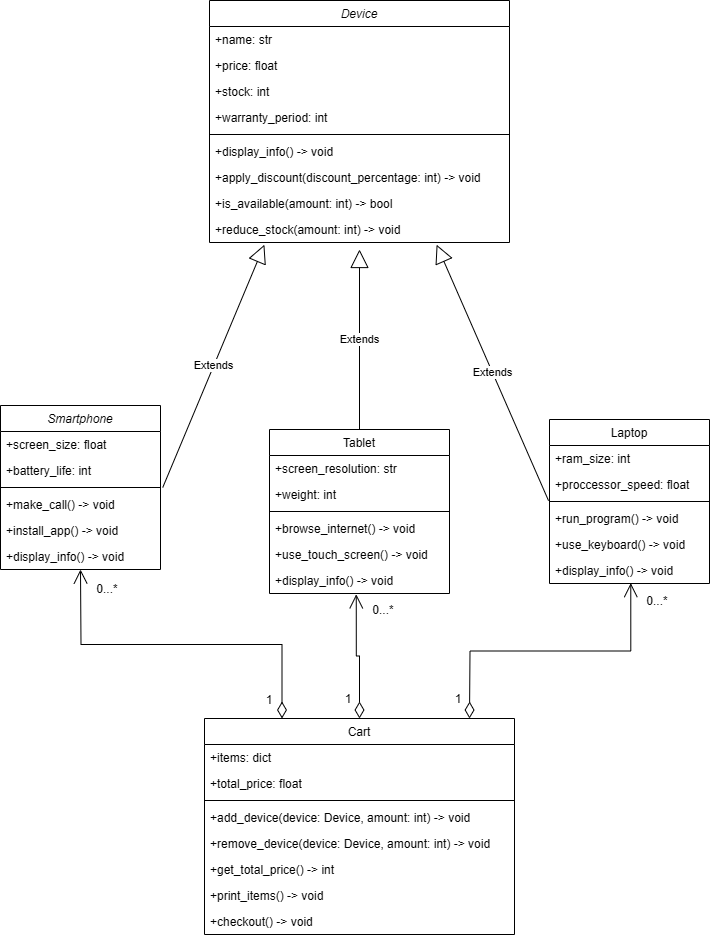

# **Electronic Device Shopping** 🛒
This repository contains a Python project that simulates an electronic device shopping system using Object-Oriented Programming (OOP) principles. The main components of the system include Cart, Smartphone, Tablet, Laptop, and Device classes.

## **Classes** 📚

### **Device** 📱💻
The `Device` class is the base class for all electronic devices.

#### **Attributes**
- `name` (str): The name of the device.
- `price` (float): The price of the device.
- `stock` (int): Amount of devices.
- `warranty_period` (int): Duration of warranty in months.

#### **Methods**
- `display_info()`: Prints out all the attributes of the instance in formatted manner.
- `apply_discount(discount_percentage)`: Reduces the `price` by `discount_percentage`%.
- `is_available(amount)`: Checks if the device in certain amount is available.
- `reduce_stock(amount)`: Returns `stock - amount`.

#### **Example**
```python
device = Device(name="Apple Iphone 13", price=599.99, stock=4, warranty_period=12)
print(device.is_available(3)) # Output: True
```

### **Smartphone** 📱
The `Smartphone` class inherits from the `Device` class and includes additional attributes `screen_size` and `battery_life`.

#### **Attributes**
- `screen_size` (float): The size of the screen in inches.
- `battery_life` (int): The time it takes for the smartphone's charge to drop from 100% to 0%.

#### **Methods**
- `make_call()`: Simulates the call.
- `install_app()`: Simulates app installation.
- `display_info()`: Prints out all the attributes of the instance in formatted manner.

#### **Example**
```python
s = Smartphone(name="Samsung Galaxy S21", price=999.99, stock=6, warranty_period=6, screen_size=6.2, battery_life=24)
s.make_call() # Output Smartphone Samsung Galaxy S21 is making a call
```

### **Tablet** 📲
The `Tablet` class inherits from the `Device` class and includes additional attributes specific to tablets, such as `screen_resolution` and `weight`.

#### **Attributes**
- `screen_resolution` (str): The screen resolution of the tablet.
- `weight` (int): The weight of the tablet in grams.

#### **Methods**
- `browse_internet()`: Simulates Internet surfing.
- `use_touch_screen()`: Simulates touch screen usage.
- `display_info()`: Prints out all the attributes of the instance in formatted manner.

#### **Example**
```python
t = Tablet(name="Huawei MatePad Pro", price=549.99, stock=25, warranty_period=8, screen_resolution="2560x1600", weight=460)
t.browse_internet() # Output: Internet is being browsed on Huawei MatePad Pro
```

### **Laptop** 💻
The `Laptop` class inherits from the `Device` class and includes additional attributes specific to laptops, such as `ram_size` and `proccessor_speed`.

#### **Attributes**
- `ram_size` (int): The capacity of RAM in GB.
- `proccessor_speed` (float): The speed of the CPU in GHz.

#### **Methods**
- `run_program()`: Simulates program running.
- `use_keyboard()`: Simulates keyboard usage.
- `display_info()`: Prints out all the attributes of the instance in formatted manner.

#### **Example**
```python
l = Laptop(name="Razer Blade 15", price=1599.99, stock=10, warranty_period=24, ram_size=16, proccessor_speed=3.2)
l.run_program() # Output: Program is running on Razer Blade 15
```

### **Cart** 🛒
The `Cart` class manages a collection of devices that a user wants to purchase. It includes methods to add devices, remove devices, and calculate the total cost of the items in the cart.

#### **Attributes**
- `items` (dict): A dictionary that contains the name of device and its amount in the cart.
- `total_price` (float): The price of all items in the cart.

#### **Methods**
- `add_device(device, amount)`: Adds a device to the cart.
- `remove_device(device, amount)`: Removes a device from the cart.
- `get_total_price()`: Returns `total_price`.
- `print_items()`: Prints all the items and their amounts that are in the cart.
- `checkout()`: Prints items, amounts and the total price in formatted manner.

#### **Example**
```python
cart = Cart()
cart.add_device(s)
cart.add_device(t)
cart.add_device(l)
total_price = cart.get_total_price()
print(f"Total price: {total_price} USD") # Output: 3149.97 USD
```

## **UML Diagram** 📊



## **main.py**

It is the main program that includes the functionality of 5 classes listed above. The program allows to choose devices from the list that will be printed, add them to cart and print all the things the cart conatins.

## **Usage** 🚀

To use this project, you can create instances of the `Smartphone`, `Tablet`, and `Laptop` classes, add them to a `Cart` instance, and perform various operations such as calculating the total cost.

```bash
git clone https://github.com/kd0nwww/electronic_device_shopping.git
cd electronic_device_shopping
python main.py
```